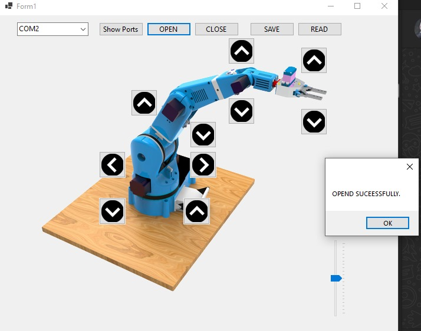

# Robot Arm Control system 
An arduino control system for robot arm and a c# visual studio app to control it and you can save motions and remake it again with this system 

Star ⭐ the repo if you like what you see😉.

#### Looks

<table>
  <tr>
      <td></td>
      <td></td>
      <td></td>
      <td></td>
      <td></td>
  </tr>
</table>
